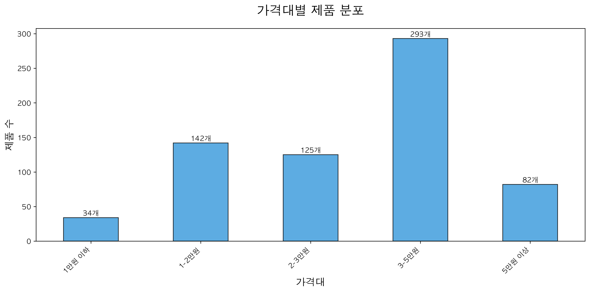

# 🛍️ Naver Shopping Tumbler Data Analysis Project

This project analyzes **tumbler product data from Naver Shopping**,  
focusing on price, capacity, and brand characteristics using Python and Jupyter Notebook.

---

## 📂 Files

| File | Description |
|------|--------------|
| `텀블러분석(네이버쇼핑).ipynb` | Main notebook for data collection, preprocessing, and visualization |
| `텀블러분석(네이버쇼핑) 2.ipynb` | Additional analysis version |
| `tumbler_analyzed.csv` | Cleaned Naver Shopping tumbler dataset |
| `capacity_price.png` | Visualization of average price by capacity |
| `price_distribution.png` | Price distribution chart |

---

## 🧠 Analysis Overview

1. Crawl product data for the keyword **"텀블러 (tumbler)"** from Naver Shopping  
2. Extract features such as product name, price, capacity, and brand  
3. Clean and preprocess the dataset  
4. Visualize the relationship between capacity and price  

---

## 📊 Visualization Results

### 🔹 Average Price by Capacity

### 🔹 Price Distribution

---

## 💡 Key Insights
- **Larger capacity tumblers have higher average prices**
- **Premium brands (e.g., Starbucks, Thermos)** dominate high-end segments  
- **Mid- to low-priced brands** focus on smaller products (under 500ml)

---

## ⚙️ Environment
- Python 3.11  
- Jupyter Notebook  
- pandas, matplotlib, seaborn  

---

## ✍️ Author
**Sebok Oh**  
> Personal data analysis and visualization practice project

